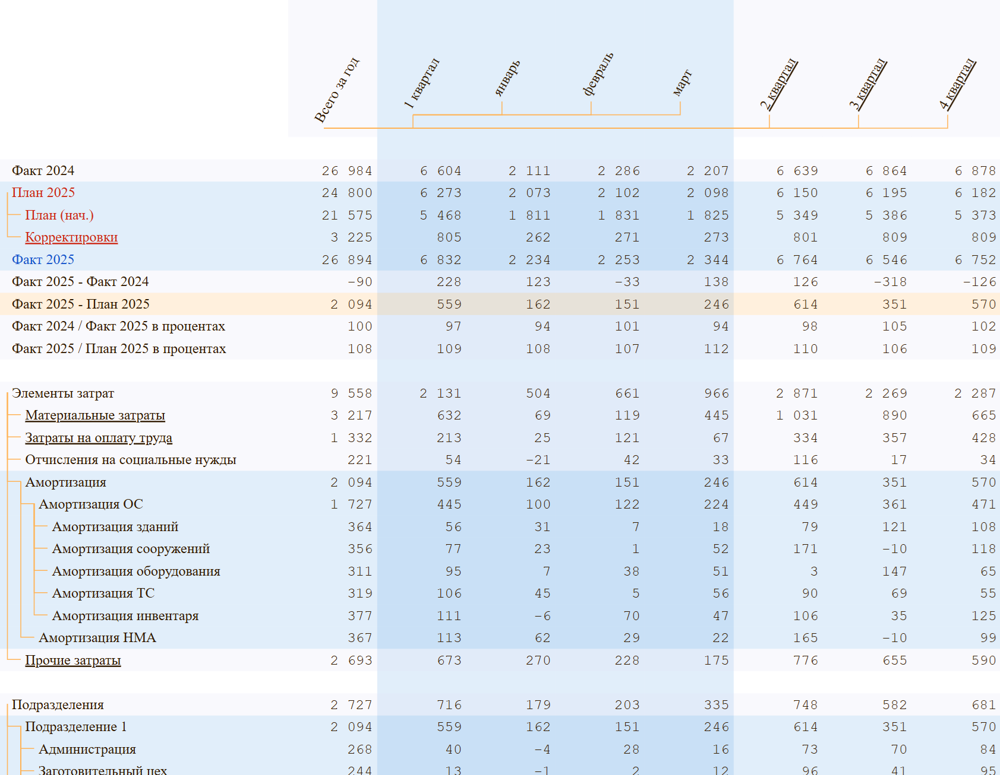
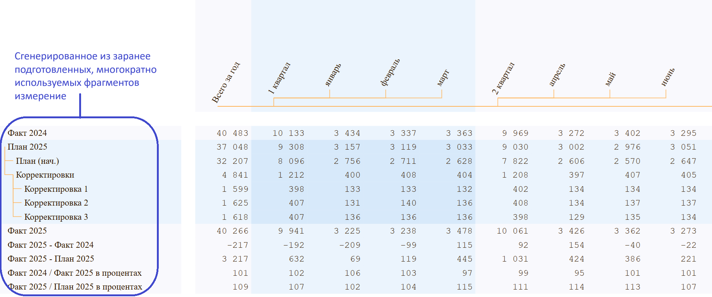

> OLAP-куб — это структура данных, используемая для представления многомерных данных в OLAP-системах (Online Analytical Processing).

В помощь аналитикам данных разработан новый OLAP-инструмент, способный расчитывать сводные отчёты по глубоким, несбалансированным иерархиям измерений, делая свою работу с ошеломительной скоростью. Реализован как JS-библиотека, открывающая дорогу десяткам тысяч программистов на поле бизнес-аналитики. Простой API позволит массово разворачивать свои собственные решения как на просторах Интернет, так и в корпоративной среде.

# Кобдик

Кобдик (Kobdik) - инструмент бизнес-аналитики (BI), написанный заново с нуля, с целью реализовать новую парадигму по формированию сводных отчётов в разрезе иерархических измерений (деревьев). Kobdik - интерактивное представление, которое преобразует аналитические данные в понятные, действенные инсайты и рекомендации для конкретной аудитории с целью информирования и помощи в принятии бизнес-решений.

Сами вычисления происходят в браузере на стороне клиента, что не даёт нагрузки на сервер. Достаточно только загрузить аналитические данные и описания измерений, а дальше можно вообще не обращаться к серверу. Память это особо не нагружает, так набор из 1 млн. записей с 7-ю измерениями и одной мерой величины займёт в памяти не более 100 Mb, что абсолютно не критично.

[Интерактивная демонстрация](https://kobdik.github.io/Cube/pfa.html)

Выберите в каждом измерении некоторые элементы, например, кликните по полям измерений (рядом с текстом): 1-й квартал, План 2025, Материальные затраты, Подразделение 1 и в результате получите четыре связанные сводные таблицы заполненные данными.

Главное отличие от существующих инструментов BI - автоматическая поддержка агрегирования (количества, суммы, минимума, максимума, среднего арифметического и среднеквадратичного значения) по измерениям, представляющим собой несбалансированные деревья. Такие деревья содержат ветви разной глубины, что может являться следствием естественного отражения структуры данных. Например, реальная оргструктура предприятия, справочники статей и элементов затрат, дерево проекта, дерево решений и т.д.

Существующие инструменты, такие как Power BI, Tableau, Qlik Sense избегают работы с несбалансированными деревьями измерений путём искусственного приведения к симметричной структуре многократным дублированием родительских элементов. Такой подход вызывает перерасход вычислительных ресурсов, замедление работы приложения, а самое главное - без участия программиста не реализуем.

Другой немаловажный фактор - реализованная в Kobdik исключительная скорость вычисления итогов по иерархическим измерениям. Так, для связанных отчётов средней глубины вложенности - более чем десятикратное ускорение. Дело в удвоении вычислительной сложности для стандартных подходов при каждом увеличении максимальной глубины иерархии.

Вкратце, об оценке сложности тут: [Скорость и сложность вычислений](./speed.md)

# Основные функциональные возможности

Kobdik поддерживает основные операции инструмента для быстрого ad-hoc анализа и прототипирования отчетов, такие как:
1. детализация вглубь (drill-dn) путём раскрытия детализации (expanding)
2. агрегирование (drill-up) путём скрытия детализации (collapsing)
3. кросс-фильтрация (cross-filtering) всех взаимосвязанных сводных отчётов
4. гибкий факт-план анализ (actual vs. forecast analysis)

Кросс-фильтрация - это, когда кликая на элементах измерений в одном сводном отчёте, получаем мгновенную фильтрацию данных, т.е. изменяем срезы данных (slicing) во всех связанных отчётах.

Механизм факт-план анализа реализован через специальный режим, который активируется или деактивируется при нажатии на соответствующем элементе вида "А - Б", это может быть "Факт - План", "Факт 2025 - Факт 2024", "Выручка - Себестоимость" (валовая прибыль). При этом, в одном отчёте мы видим строки уменьшаемого, вычитаемого и разницы, а в связанных отчётах - расшифровку этой разности по соответствующим измерениям.

Гибкость инструмента позволяет задействовать комбинацию из двух (и более) разностей. В одном отчёте выбираем разность факта и плана, в другом - разность выручки и себестоимости проданного, получая в итоге, во всех связанных отчётах, разницу между фактической и плановой валовой прибылью.

Для проведения факт-план анализа в одно специальное измерение собраны элементы факта, начального плана и корректировок плана за разные годы. Одна корректировка может затрагивать элементы материальных затрат, другая - элементы заработной платы конкретного подразделения и т.д. Такая модель позволяет в одном сводном отчёте исследовать разницы между фактами и планами разных лет, легко переключаясь на обычный режим просмотра факта или плана интересующего года с выбранными корректировками.

Возможность включать или отключать отдельные корректировки плана, отдельные элементы выручки или себестоимости продаж позволяет оценить итоговое влияние на соответствующие разницы.

# Перспективы развития продукта

## Разработка сценарного анализа (what-if analysis). 
Ввод нового типа корректировок, внутри которых можно генерировать серии аналитических данных, чтобы ответить на вопрос "а что если?". Например, кросс-фильтрацией получаем выборку аналитических данных за 1-й квартал выбранного подразделения по группе затрат на заработную плату. Затем, величины этой выборки умножаем на предполагаемый процент изменения и добавляем полученные данные в корректировку. К этой же корректировке можно добавить и другие серии за 2-й, 3-й и 4-й кварталы со своими коэффициентами. Включая или отключая данную корректировку, мы увидим разные сценарии изменения бюджета при предполагаемом изменении показателей в течение года.

## Экспорт в Excel. 

Реализация экспорта:
1. исходных аналитических данных отчёта,
2. видимые отфильтрованные данные отчета,
3. таблицы сводного отчёта как он выглядит в Kobdik.

При первом варианте выгружаются лист с колонками кодов элементов измерений и мер исходных аналитических данных, вместе с отдельным листом описания иерархических измерений.

При втором варианте выгружаются лист с колонками кодов элементов измерений и мер отфильтрованных аналитических данных, вместе с отдельным листом описания иерархических измерений.

Третий вариант должен создать книгу Excel со страницей, оформленной близко к сводному отчёту на момент выгрузки, с разнесёнными по ячейкам данными. Положение ячеек должно определяться через координаты именованных ячеек элементов измерений. Например, сводная сумма за 1 квартал по заработной плате должна стоять на пересечении строки, содержащей ячейку с именем "elz2", и колонки, содержащей ячейку с именем "с1". Такой вариант выгрузки отчёта позволит, при необходимости, доработать его и легко интегрировать с другими книгами Excel.

## Импорт из Excel. 

Реализация импорта из книги Excel, содержащей лист с исходными аналитическими данными в формате колонок с кодами элементов измерений и мер, а также листа с описаниями иерархических измерений.

## Дашборды

Разработка дашбордов, графиков прямо поверх сводных таблиц, не имеет ограничений. Сами сводные таблицы реализованы как SVG-графика, поэтому программисты могут легко считывать объекты, связанные с ними данные, стилизовать с помощью CSS, расширять возможности графического представления самостоятельно.

## Разработка API для корпоративных клиентов

Индивидуальная разработка API под нужды корпоративных клиентов с возможностью пакетной загрузки данных в двоичном формате. Предоставление структуры и SQL запросов к БД, конфигуратора иерархий для повторного использования аналитических данных с разными представлениями иерархий измерений. 

Самый простой пример, создание разнообразных иерархий календарных периодов для подготовленных аналитических данных: из кварталов и месяцев; только месяцев; 9-ти месяцев, полугодия, кварталов и месяцев; включить во все эти комбинации годы. При этом, исходные аналитические данные остаются прежними.

Более сложный пример. 
Когда мы хотим генерировать измерения из заранее подготовленных, повторно используемых описаний элементов. Генерируются не только измерения, но и наборы аналитических данных по специальным SQL запросам на основе настроечных таблиц конфигураций.

# Вовлечение JS-программистов

Kobdik реализован как библиотека на JavaScript, что открывает возможности подключения широкого круга JS-программистов в работу по бизнес-аналитике. Простой API позволит использовать все имеющиеся возможности библиотеки, без зависимости от проприетарных инструментов BI на стороне сервера.

# Контакты

По вопросам сотрудничества, приобретения продукта, обращайтесь в ТГ @Tulegen_Kobdikov, пишите на мейл ndi89@mail.ru, найдите меня в VK.

С уважением, Кобдиков Тулеген.