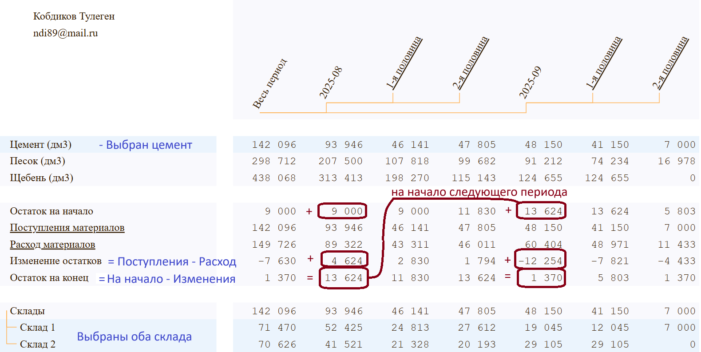
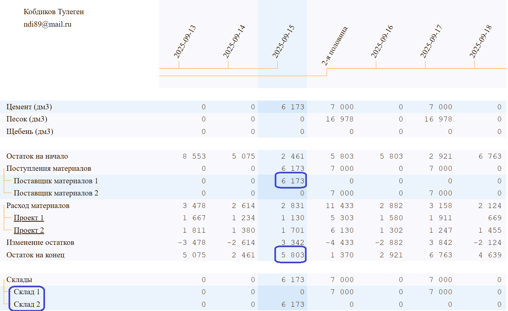
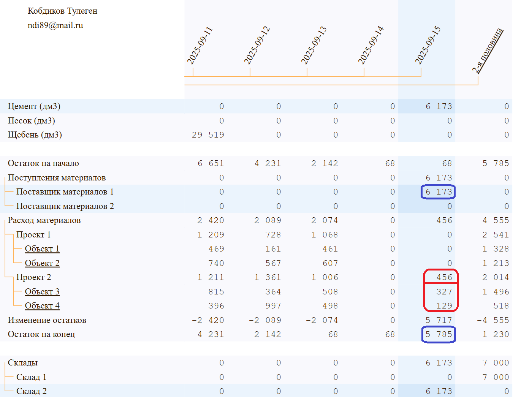
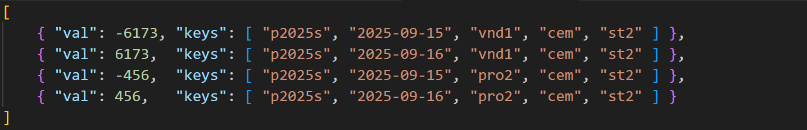
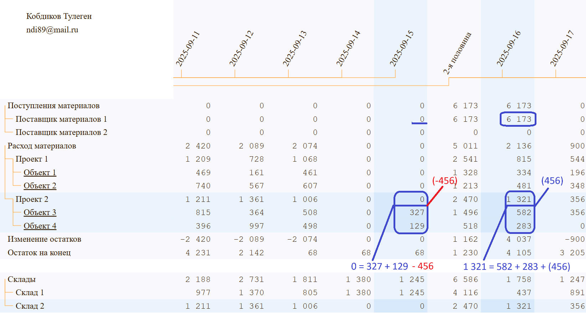
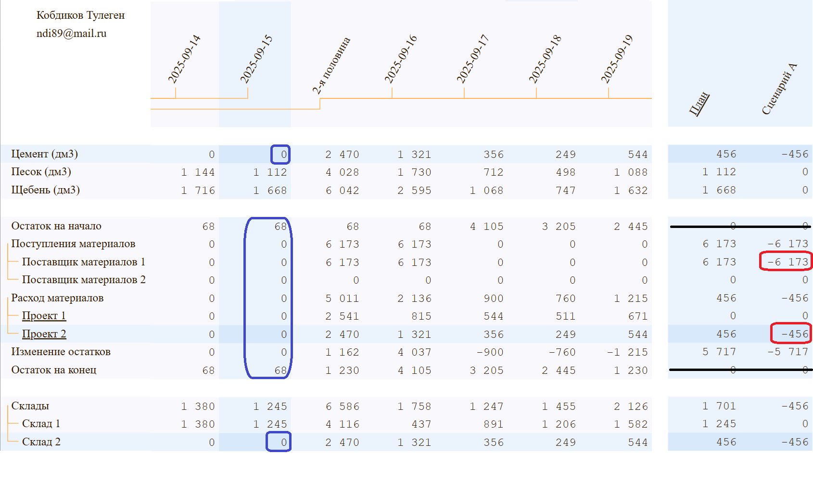

# Анализ движения материалов 

Демонстрация планирования прихода, расхода и остатков материалов, используемых при строительстве на различных объектах с помощью библиотеки Kobdik. Допустим, имеются два склада, два поставщика материалов и два строительных проекта, в каждом из которых по два объекта и множество выполняемых задач, где расходуются материалы.

Можете сразу перейти к демо: [Анализ движения материалов](https://kobdik.github.io/Cube/mat.html)

## Описание сводного отчёта

На контроле три расходных материала:
1. Цемент
2. Песок
3. Щебень

Для расчета остатков используются следующие формулы: 
- Изменение остатка = Поступление материалов - Расход материалов. 
- Остаток на конец = Остаток на начало + Изменение остатка

Остаток на конец дня становится остатком на начало следующего дня, остаток на конец месяца становится остатком на начало следующего месяца. Движения материалов считаем в натуральных величинах (дм3), если разделить все величины на 1000, то получим значения в кубометрах.

В сводном отчёте ниже выбраны *Цемент*, оба поставщика (скрыты внутри *Поступления материалов*) и оба склада. Таким образом, в верхней таблице с материалами указаны совокупные объемы поставок материалов на оба склада, в средней таблице - расчёт остатков цемента, а в нижней таблице - объемы поставок цемента на склады.

## Определение проблемной ситуации

Оба проекта закрываются к 20 сентября, поэтому неудивительно, что в сентябре наблюдается снижение остатков цемента на складах (-12 254). Допустим, сегодня 11 сентября. Раскрыв первую половину сентября, рассмотрим движения материалов после 11 числа детальнее. 

Намётанный глаз заметит, что на 15 сентября запланирована поставка цемента в объеме 6 173 на 2-й склад и остаток на складах составит 5 803. Возможен неблагоприятный сценарий: если поставка задержится на 1 день, то на складах случится нехватка цемента в размере 5 803 - 6 173 = -370. Это аналог кассового разрыва в бюджете движения денежных средств.

Поставка запланирована на 2-й склад, поэтому, выберем *Склад 2* и увидим остаток на конец дня на этом складе в размере 5 785. Допустим, мы считаем затратным перебрасывать несущественные остатки (388 - 370 = 18) со склада на склад, поэтому, в случае задержки поставки на 1 день, на 2-м складе возникнет нехватка цемента в размере 5 785 - 6 173 = -388, которую надо как-то закрыть.

## Проработка неблагоприятного сценария

Закрыть дефицит цемента в размере 388 можно, заморозив расход цемента со 2-го склада. Для этого раскроем детали расходов и выберем проект с расходами, превышающими дефицит.

Как видим, в случае задержки поставки следует заморозить все связанные расходы (цемент, песок, щебень) по 2-му проекту, относящиеся ко 2-му складу. Для простоты описания сценария, мы ограничимся необходимой заморозкой расходования цемента со 2-го склада в размере 456 единиц (дм3) по 2-му проекту на 1 день до 16 сентября.

Ввод данных сценария по переносу данных на другое число похож на сторнирующие проводки: дублируем записи от 15 сентября по поставке и расходу цемента со 2-го склада со знаком "минус", дублируем те же записи с новой датой *16 сентября* со знаком "плюс". Для краткости, не будем сторнировать каждую из детализирующих записей 2-го проекта (объекты, задачи), вместо этого введём общей величиной 456 по статье *Проект 2*.

## Структура аналитических данных

Ввод данных сценария происходит через вызов API, которому передаётся имя JSON-файла для загрузки. Например, рассмотренный сценарий загружает следующее содержимое:

Каждая запись содержит:
- val - объем материала
- keys - массив из 5-ти обобщенных измерений 

Элементы массива keys:
- первое измерение - *Планы* (везде указан код элемента *Сценарий A*),
- второе измерение - *Периоды* (указаны даты переноса объёмов), 
- третье измерение - *Статьи* (указаны коды поставщиков и проектов),
- четвёртое измерение - *Материалы* (везде указан код элемента *Цемент*),
- пятое измерение - код *Склады* (везде указан код элемента *Склад 2*)

Несложно разработать пользовательский интерфейс для редактирования данных начального плана, корректировок и сценариев.

## Активация неблагоприятного сценария

В таблице справа активируем *Сценарий А* и посмотри на расчёты итогов по 2-му проекту.

Итог в строке *Проект 2* будет включать в себя итоги 3-го и 4-го объектов, а также сторнирующую сумму.

Закроем детализацию проектов. По сценарию мы перенесли поставку на 16 сентября, закрыли дефицит цемента на 2-м складе в размере 388 единиц, при этом не останавливали расход цемента с 1-го склада.

Далее, можно анализировать движения материалов с учётом или без данных разработанного сценария, количество сценариев можно увеличить и произвольным образом комбинировать. 

## Резюме инструмента BI-аналитики

Для демонстрации возможностей библиотеки Kobdik были использованы основные операции инструмента для быстрого ad-hoc анализа и прототипирования отчетов, такие как:
1. детализация вглубь (drill-dn) путём раскрытия детализации (expanding)
2. агрегирование (drill-up) путём скрытия детализации (collapsing)
3. кросс-фильтрация (cross-filtering) всех взаимосвязанных сводных отчётов
4. сценарный анализ (what-if analysis)

На примере анализа движения материалов, нетрудно представить реализацию бюджета движения денежных средств с несколькими валютами.