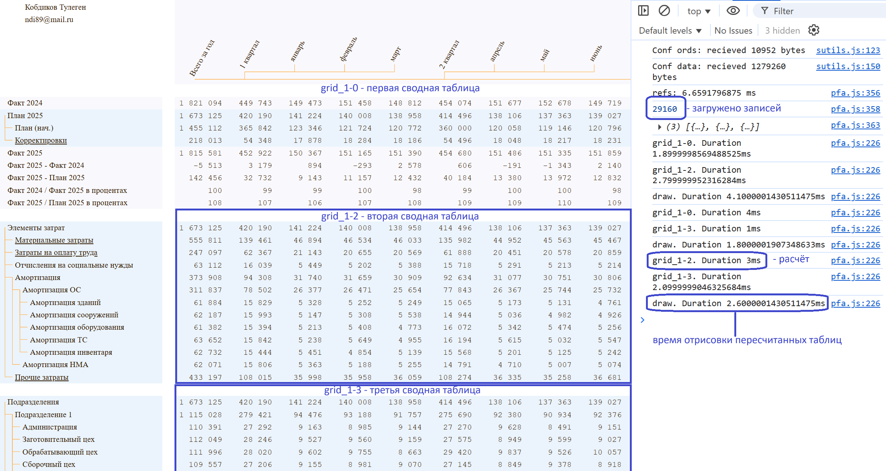
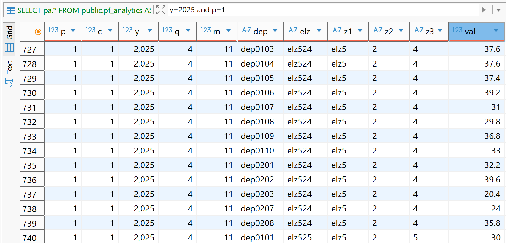
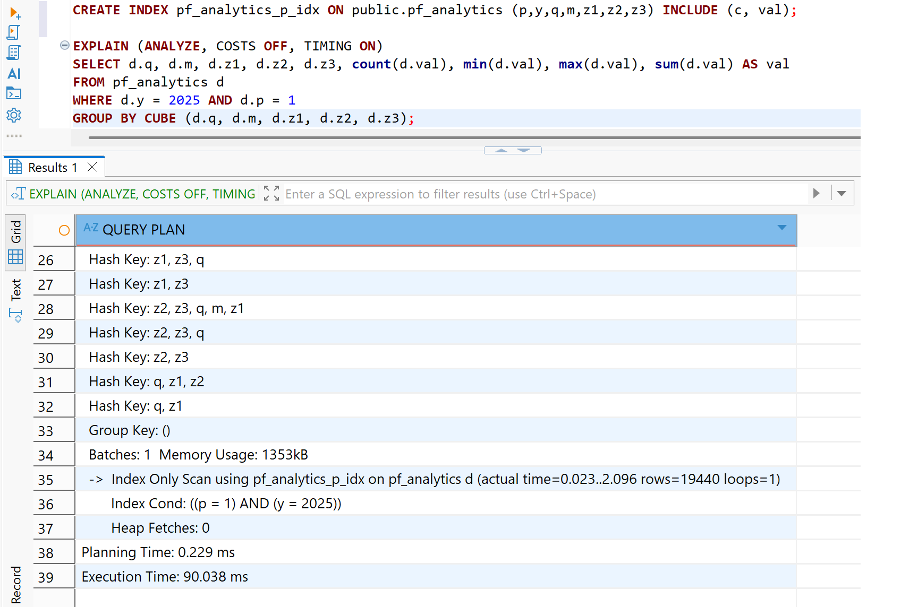
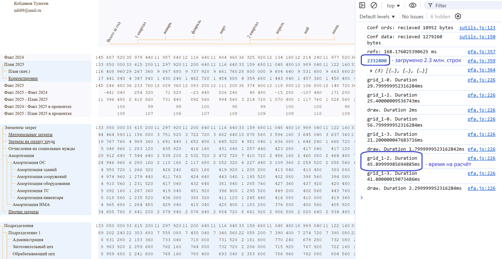
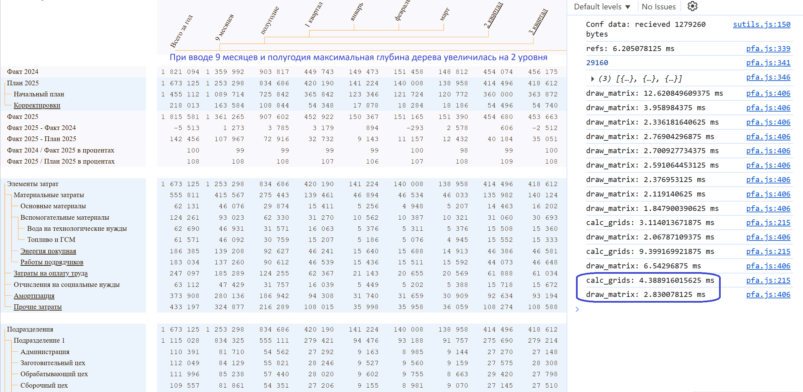
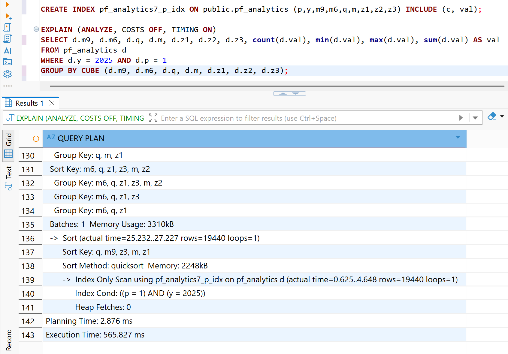

# Доступ к деталям

Чем больше глубина аналитики, тем выше вероятность выявления скрытых закономерностей, зёрен роста, так и возможных проблем. Операция детализации (drill-dn) относится к столпам аналитики данных, обращает фокус внимания на детали. Так почему все стандартные инструменты аналитики избегают применения глубокой аналитики? 

В лучшем случае, предлагается последовательный спуск к более глубоким слоям, что сопровождается задержками для подгрузки данных детализации. Для презентации это может и не критично, но для аналитика данных, который хотел бы "глянуть глубже" на нижние уровни и вернуться обратно, не затрачивая времени на обновления системой экрана и не теряя фокуса внимания, такой подход, как минимум, утомляет и раздражает.

# Сложность вычислений и скорость расчёта

Для примера, рассмотрим представленный в интерактивной демонстрации сводный отчёт и сфокусируемся на второй сводной таблице, где отражены итоги элементов затрат в разрезе календарных периодов. Выберем все элементы затрат, все подразделения. При выборе в первой сводной таблице строки *План 2025* происходит фильтрация 19 440 из 29 160 строк загруженных аналитических данных, расчёт итогов второй и третьей сводных таблиц, за 3ms - второй и за 2.1ms - третьей, совокупное время отрисовки второй и третьей сводных таблиц - 2.6ms.

>Все замеры осуществлялись на ноутбуке i7-11370H с 16 Gb ОЗУ и двумя процессорами по 3.30 GHz.

Стандартная парадигма расчёта сводных таблиц (в Power BI, Tableau и т.д.) опирается на SQL-запрос GROUP BY CUBE по колонкам измерений исходной таблицы с аналитическими данными. Иерархии формируются на лету из тех же измерений. Инструменты BI, будучи надстройками над драйверами баз данных, не могут работать быстрее времени исполнения SQL-запросов GROUP BY CUBE. Посмотрим на примере PostgreSQL, сколько времени займёт  расчёт итогов второй сводной таблицы при тех же условиях.

Для получения иерархии календарных периодов используем 2 колонки (с кварталами и месяцами), а для получения иерархии элементов затрат с максимальной глубиной вложенности в 3 уровня используем 3 колонки для описания каждого уровня.

Заполнил таблицу теми же 29 160 записями, со следующей структурой: p=1 для плановых показателей, c - корректировки, y - годы, m9 - 9 месяцев, m6 - полугодие, q - кварталы, m - месяцы, dep - подразделения, elz-элементы затрат разбиты на 3 уровня z1, z2, z3, а также val - величина затрат.

Сводная таблица расчитывается в стандартной парадигме с помощью SQL-запроса GROUP BY CUBE по 5 колонкам (3 уровня элементов затрат и 2 уровня календарных периодов), образующим деревья двух его измерений. Оценочно, в лучшем случае, сложность вычислений составит O(2^k * n_rows), где k = 5 - количество колонок, образующих уровни вложенности по вертикали и горизонтали, n_rows = 19 440 - количество отфильтрованных строк записей из 29 160 загруженных аналитических данных.

Формула O(2^k * n_rows) требует пояснения. Для каждой отфильтрованной строки из n_rows надо произвести поиск всех накопителей агрегатов. Эти накопители распределены по хеш‑таблицам, у которых ключи формируются из уникального набора колонок, наподобие (), (col1), (col2), (col1, col2). Так вот количество хэш-таблиц, равное количеству всевозможных комбинаций колонок, равно 2^k, где k - общее количество колонок.

## Доказательство формулы методом математической индукции

Проверим истинность формулы для некоторого n. Например, при n=1, получаем: (), (col1), всего 2 комбинации, что равно 2^1, формула верна. При n=2, получаем следующие комбинации колонок: (), (col1), (col2), (col1, col2), всего 4 комбинации, что равно 2^2, формула верна. 

Пусть количество всевозможных комбинаций из n колонок равно N. Докажем, что при добавлении новой колонки количество комбинаций удваивается. Количество комбинаций, где нет новой колонки, по условию равно N. Количество комбинаций M, где появилась новая колонка, должно быть равно N. Если бы это было не так, M <> N, то мы могли бы убрать из всех этих комбинаций новую колонку и получить прежнее множество, содержащее N комбинаций, что привело бы к противоречию M <> N. Следовательно, M = N, при добавлении новой колонки, количество всевозможных комбинаций колонок удваивается.

Если формула количества всевозможных комбинаций 2^n верна для некоторого n, а мы проверили истинность при n=1 и n=2, то для n+1 получаем формулу 2^(n+1). Так как количество всевозможных комбинаций колонок удваивается, то оно должно быть равно 2^n * 2, что преобразуется в 2^(n+1), истинность формулы для n+1 доказана, исходя из истинности формулы для n, cледовательно, формула будет верна и для всех n > 2. 

## Скорость исполнения

Произведём оценку времени на вычисление агрегатов с помощью GROUP BY CUBE по 5 колонкам. Аналогичные агрегаты (COUNT, MIN, MAX, SUM) вычисляются при замерах Kobdik, хотя отображается только SUM.

Время на расчёт второй сводной таблицы заняло 90ms. Kobdik в браузере, опираясь на быстрый алгоритм, расчитал итоги в 30 раз быстрее, чем PostgreSQL! Причём, разница в скорости намного больше и становится заметна при увеличении n_rows. Так, постепенное увеличение n_rows в 80 раз увеличило время расчёта только в 15 раз, т.е. на полутора миллионах отфильтрованных данных расчёт будет происходить в 30 * 80 / 15 = 160 раз быстрее.

Kobdik не боится глубоких деревьев, увеличение максимального уровня вложенности в иерархиях измерений существенно не влияет на скорость вычислений. Увеличение максимальной глубины измерения календарных периодов на 2 уровня, не увеличило время расчёта сводной таблицы, которое в данном эксперименте даже немного снизилось с 3ms до 2.8ms.

## Время на расчёт итогов

| n_rows (записей) | k (уровней вложенности) | Время, (ms) | Комментарии                  |
|------------------|-------------------------|-------------|------------------------------|
|          19 440  |            7            |     2.8     |  Kobdik  (не зависит от k)   |
|          19 440  |            5            |  2.5 - 3.0  |  Kobdik                      |
|          97 200  |            5            |     4.5     |  Kobdik     (19 440 X 5)     |
|         194 400  |            5            |     8.0     |  Kobdik     (19 440 X 10)    |
|         388 800  |            5            |    13.6     |  Kobdik     (19 440 X 20)    |
|         777 600  |            5            |    23.9     |  Kobdik     (19 440 X 40)    |
|       1 555 200  |            5            |    45.9     |  Kobdik     (19 440 X 80)    |
|          97 200  |            5            |   499.8     |  PostgreSQL (19 440 X 5)     |
|          19 440  |            7            |   565.8     |  PostgreSQL                  |
|          19 440  |            6            |   212.7     |  PostgreSQL                  |
|          19 440  |            5            |    94.0     |  PostgreSQL                  |
|          19 440  |            4            |    41.4     |  PostgreSQL                  |
|          19 440  |            3            |    20.8     |  PostgreSQL                  |

Для Kobdik сложность вычислений O(n_rows), но имеется константное время расчёта матрицы, при данном наборе измерений - около 1.9ms, которое значимо при малых n_rows < 200 000, но почти незаметно при n_rows >> 200 000.

PostgreSQL при k < 7 исполнял запросы в соответствии с вычислительной сложностью O(2^k * n_rows), а при k = 7 превысил время с ожидаемых 400ms до 565ms в связи с сортировкой ключей, несмотря на использование покрывающего индекса по всем полям запроса, "прогрев запроса" многократным исполнением. К тому же, скорее всего при shared_buffers=128MB и work_mem=256MB, вся небольшая база данных кэшировалась в ОЗУ.

## Расчёт больших объёмов данных

Если бы стояла задача обработать 1.5 миллиона отфильтрованных данных при той же конфигурации измерений, то времени на расчёт итогов при стандартном подходе с помощью GROUP BY CUBE ушло бы не менее 7.5s, что является неприемлемым для OLAP-инструмента.

Пришлось бы прибегнуть к последовательному спуску между уровнями, чтобы растянуть во времени доступ к деталям. Также, появился бы соблазн снизить глубину аналитик, каждое такое снижение (упрощение аналитики) ускоряло бы расчёт в два раза.

На практике, проектная аналитика зачастую имеет глубину в 6-7 уровней в измерении видов затрат, а календарные периоды - до 4 уровней. Те же 1.5 млн. отфильтрованных аналитических данных в Kobdik будут рассчитаны менее чем за 50ms. При этом, обеспечат моментальную детализацию, раскрывая по клику интересующие ветки. 

Количество аналитических данных на вход можно существенно ограничить с помощью Materialized View, предварительно расчитав агрегаты по ключам всех измерений с помощью GROUP BY (Col1, Col2, Col3, ..., ColN). Количество таких агрегатов будет зависеть только от количества, кардинальности (количества элементов) и глубины измерений, поэтому, в подавляющем большинстве ситуаций, легко разместится в оперативной памяти. При анализе миллиардов записей предварительное кэширование агрегированных результатов по ключам всех измерений позволит применять OLAP обработку данных в памяти.

Конечно, размер матрицы сводного отчёта может оказаться за пределами 70 X 20 = 1 400, например, 70 X 800 = 56 000 ячеек, если в календарные периоды добавить пару лет с детализацией до дней. Главное, постараться не выйти далеко за пределы рабочего диапазона отрисовки в SVG по количеству элементов, что примерно равно 100 тысячам ячеек.

Переходите к демо c 2 332 800 сгенерированными строками аналитических данных, выберите *План 2025*, либо *Факт 2025*, либо разницу между ними:

[Интерактивная демонстрация](https://kobdik.github.io/Cube/pfam.html)